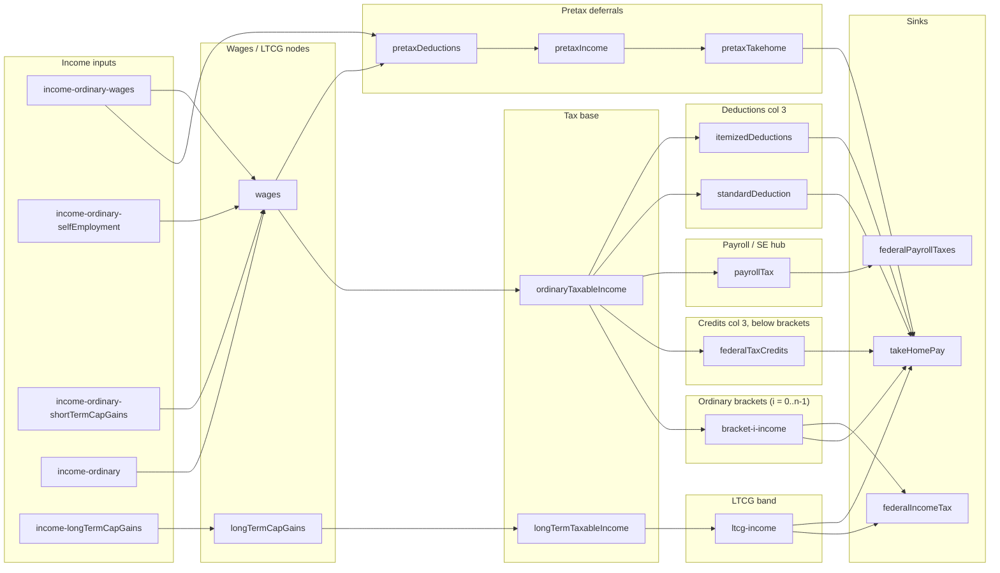

# Sankey link topology

Mermaid diagram of Sankey **source → target** edges defined under `[src/lib/config/page](../src/lib/config/page)`. Parallel links with the same endpoints are drawn once. Ordinary bracket slices use `bracket-i-income` for each index `i` from `[getBracketItems](../src/lib/config/page/taxBracketNodes.ts)`.

**Credits layout:** Credit **inputs** use a Sankey **node** on the credits row/col (below brackets, col 3). The **take-home path for credits** matches deductions: **`ordinaryTaxableIncome` → `federalTaxCredits` → `takeHomePay`**, with link values = `computeFederalTaxCreditsApplied` (same cap as `federalTaxCreditsApplied`). The row index is `getCreditsSankeyRow` in [`pageConfig.helpers.ts`](../src/lib/config/page/pageConfig.helpers.ts).

## Implementation notes

- Pretax inputs each register `wages` → `pretaxDeductions` (same edge, multiple config rows).
- Payroll and SE: a single ribbon **`ordinaryTaxableIncome` → `payrollTax`** uses `sankeyOrdinaryToPayrollTax` (payroll + SE). **`payrollTax` → `federalPayrollTaxes`** splits into wage FICA (`payrollTax`) and SE (`selfEmploymentTax`) rows so link values still balance at the hub.
- Each federal ordinary bracket adds nodes `bracket-i-income`, `bracket-i-keep`, `bracket-i-tax`; Sankey links use `bracket-i-income` as the hub for flows to `takeHomePay` (keep) and `federalIncomeTax` (tax). LTCG tax flows `ltcg-income` → `federalIncomeTax`; LTCG keep flows to `takeHomePay`.
- **Federal income tax node:** Bracket and LTCG tax ribbons terminate at `federalIncomeTax` (gross tax per slice); the node’s summary value is still net federal income tax after credits (link sums may not match that number). [`taxNodes.ts`](../src/lib/config/page/taxNodes.ts) bridges `sankeyOrdinaryToFederalTaxCredits` and `sankeyFederalTaxCreditsToTakeHome` add **`ordinaryTaxableIncome` → `federalTaxCredits` → `takeHomePay`** using `computeFederalTaxCreditsApplied` in [`taxCalculations.ts`](../src/lib/config/page/taxCalculations.ts).
- Credit **input** rows in [`creditInputs.ts`](../src/lib/config/page/creditInputs.ts) keep a Sankey **node** for styling but do **not** emit Sankey **links** into `federalTaxCredits` (avoids double-counting the hub; amounts still drive totals via `federalTaxCredits`’s `calculate: totalCredits`).
- Refundable credit amounts beyond gross federal tax are not shown as a separate ribbon (same cap as `federalTaxCreditsApplied`).

**Other Sankey implementation:** [`taxCharts.sankeyBuilder.ts`](../src/lib/taxCharts.sankeyBuilder.ts) builds a separate chart from `TaxResult` metrics (including `allocateFederalCreditsTopMarginalSlices` in [`taxCharts.visualizationBundle.ts`](../src/lib/taxCharts.visualizationBundle.ts)). That pipeline is not the same as the page `configItem` graph above.
