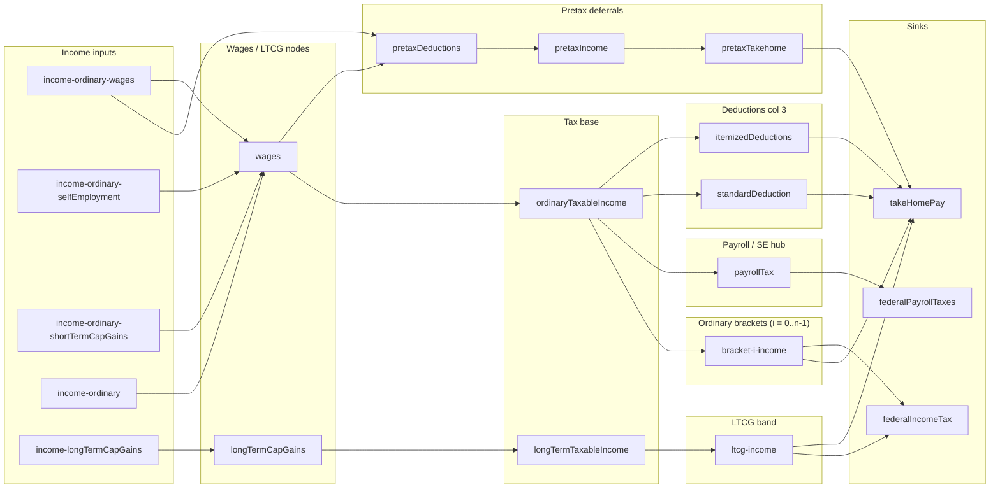

# Sankey link topology

Mermaid diagram of Sankey **source → target** edges defined from `sankey.links` on [`ConfigItem`](../src/lib/config/taxPage/types.ts) rows assembled by [`getConfigItems`](../src/lib/config/taxPage/taxPage.config.ts). Parallel links with the same endpoints are drawn once. Ordinary bracket slices use `bracket-{i}-income` for each index `i` from [`getBracketItems`](../src/lib/config/taxPage/nodes/taxBracketNodes.ts).

**Credits layout:** Federal credits that reduce tax show as **per-bracket** and **LTCG** ribbons from each rate hub to `takeHomePay` (see `bracket-{i}-credits` and `ltcg-credits` in [`taxBracketNodes.ts`](../src/lib/config/taxPage/nodes/taxBracketNodes.ts)), with link values from the same bucket logic as `federalTaxCreditsApplied` in [`deductionNodes.ts`](../src/lib/config/taxPage/nodes/deductionNodes.ts). Credit **inputs** use a Sankey **node** on the credits row/col (via [`getCreditsSankeyRow`](../src/lib/config/taxPage/sankey/sankeyLayout.helpers.ts)) for styling; they do **not** define separate hub edges into a single `federalTaxCredits` config node (that hub was removed as unused).

## Implementation notes

- Pretax inputs each register `wages` → `pretaxDeductions` (same edge, multiple config rows).
- Payroll and SE: a single ribbon **`ordinaryTaxableIncome` → `payrollTax`** uses `sankeyOrdinaryToPayrollTax` (payroll + SE). **`payrollTax` → `federalPayrollTaxes`** splits into wage FICA (`payrollTax`) and SE (`selfEmploymentTax`) rows so link values still balance at the hub.
- Each federal ordinary bracket adds nodes `bracket-{i}-node`, `bracket-{i}-income`, `bracket-{i}-keep`, `bracket-{i}-credits`, `bracket-{i}-tax`; Sankey links use `bracket-{i}-income` as the hub for flows to `takeHomePay` (keep and credits) and `federalIncomeTax` (tax). LTCG tax flows `ltcg-income` → `federalIncomeTax`; LTCG keep and credits flow to `takeHomePay`.
- **Federal income tax node:** Bracket and LTCG tax ribbons terminate at `federalIncomeTax` (gross tax per slice); the node’s summary value is still net federal income tax after credits (link sums may not match that number). Credits to take-home are carried on **`bracket-{i}-credits`** and **`ltcg-credits`** links in [`taxBracketNodes.ts`](../src/lib/config/taxPage/nodes/taxBracketNodes.ts), not via a separate config-only bridge row.
- Credit **input** rows in [`creditInputs.ts`](../src/lib/config/taxPage/inputConfigs/creditInputs.ts) keep a Sankey **node** for styling; ribbon amounts for credits applied come from bracket/LTCG slice config, aligned with `federalTaxCreditsApplied` in [`deductionNodes.ts`](../src/lib/config/taxPage/nodes/deductionNodes.ts).
- Refundable credit amounts beyond gross federal tax are not shown as a separate ribbon (same cap as `federalTaxCreditsApplied`).

**Other Sankey implementation:** [`taxCharts.sankeyBuilder.ts`](../src/lib/taxCharts.sankeyBuilder.ts) builds a separate chart from `TaxResult` metrics (including `allocateFederalCreditsTopMarginalSlices` in [`taxCharts.visualizationBundle.ts`](../src/lib/taxCharts.visualizationBundle.ts)). That pipeline is not the same as the page `configItem` graph above.
