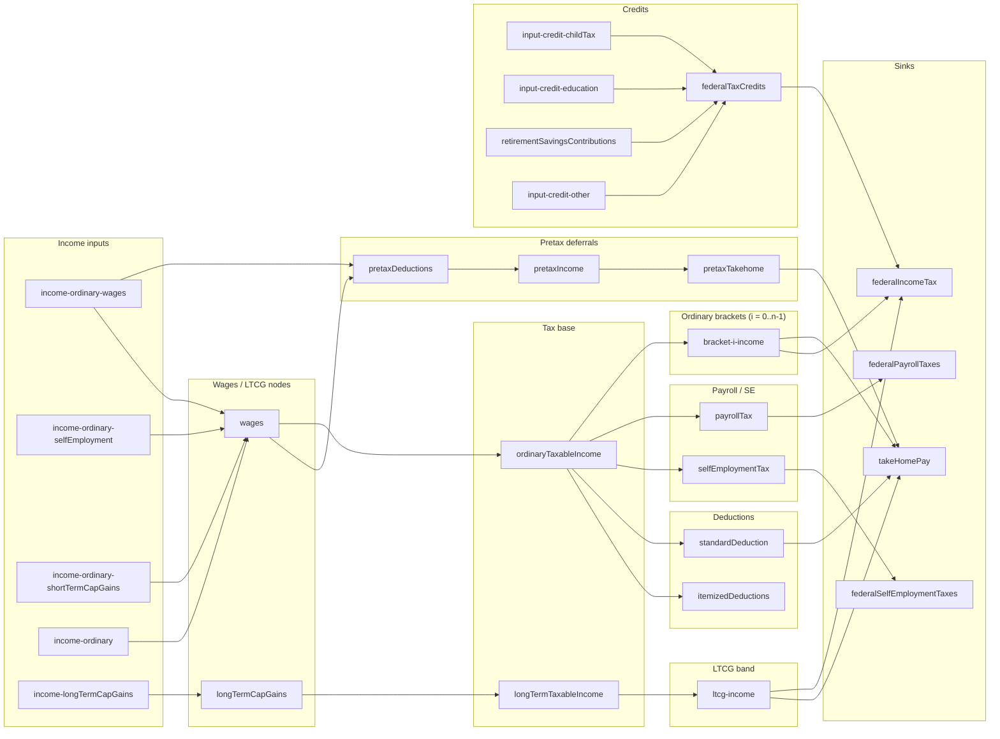

# Sankey link topology

Mermaid diagram of Sankey **source → target** edges defined under `[src/lib/config/page](../src/lib/config/page)`. Parallel links with the same endpoints are drawn once. Ordinary bracket slices use `bracket-i-income` for each index `i` from `[getBracketItems](../src/lib/config/page/taxBracketNodes.ts)`.

## Implementation notes

- Pretax inputs each register `wages` → `pretaxDeductions` (same edge, multiple config rows).
- Payroll: `ordinaryTaxableIncome` → `payrollTax` → `federalPayrollTaxes` (via `payrollTaxWages` and `payrollTax` items).
- `itemizedDeductions` → `takeHomePay` exists only as a commented-out link in `incomeNodes.ts`.
- Each federal ordinary bracket adds nodes `bracket-i-income`, `bracket-i-keep`, `bracket-i-tax`; Sankey links use `bracket-i-income` as the hub for flows to `takeHomePay` and `federalIncomeTax`.

